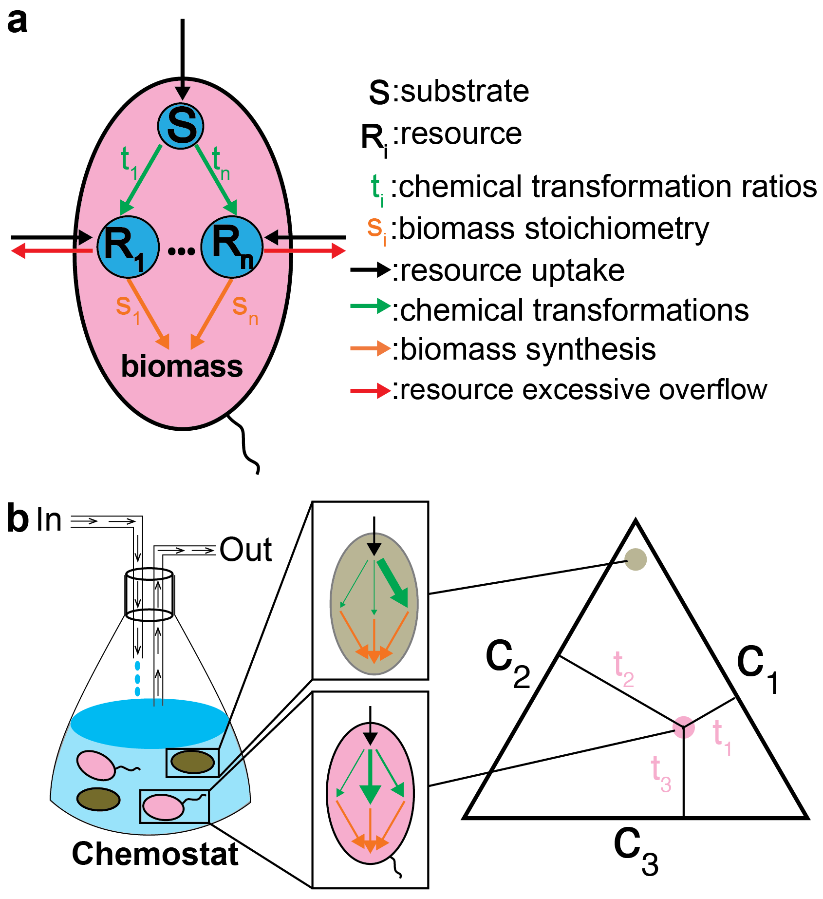

# Higher-Order Interactions in Auxotroph Communities Enhance Their Resilience to Resource Fluctuations
This repository contains scripts used for simulatingng our auxotroph model and generating the results. A preprint that describes the method in detail can be found [here](). 


The model captures a general situation in which microbial strains are capable of converting (green arrows) a single externally supplied carbon source (e.g., glucose) into multiple essential resources (e.g., amino acids). We assume that a fraction of essential resources is stoichiometrically converted to biomass synthesis (red arrows), while the rest overflows into the environment (orange arrows). We also assume that all species can freely use overflow resources released by other species (black arrows). Lastly, we assume that the stoichiometry in which essential resources are used for biomass synthesis is the same across all species. 

## Versions
The version of Python we used is 3.7.3.

## Dependencies
Necessary Python packages can be found in `requirements.txt`. For the Mac or Linux users, installing those packages can be achieved by pip:
```
pip install -r requirements.txt
```

## License

This project is covered under the **MIT License**.